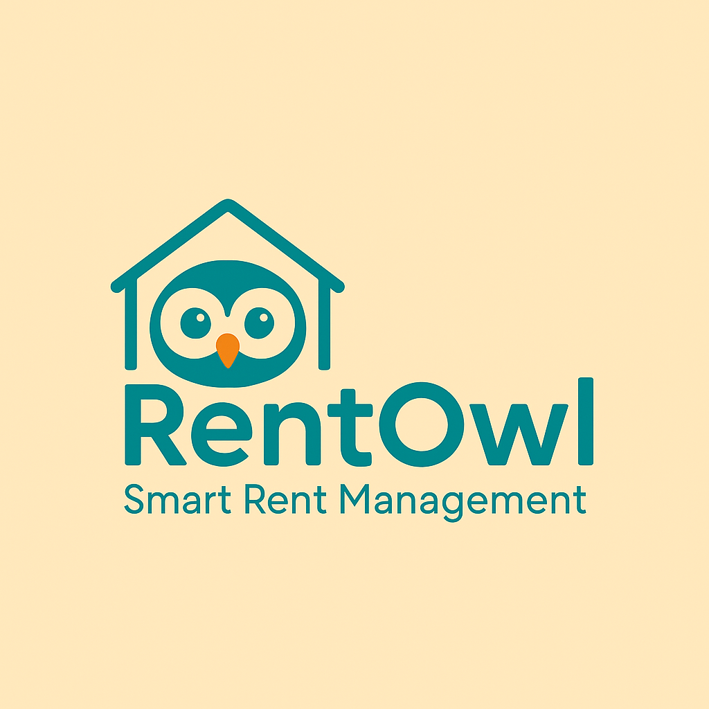
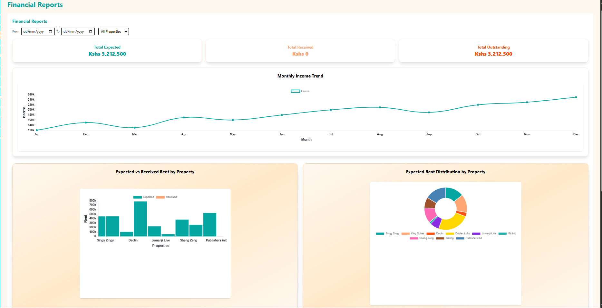
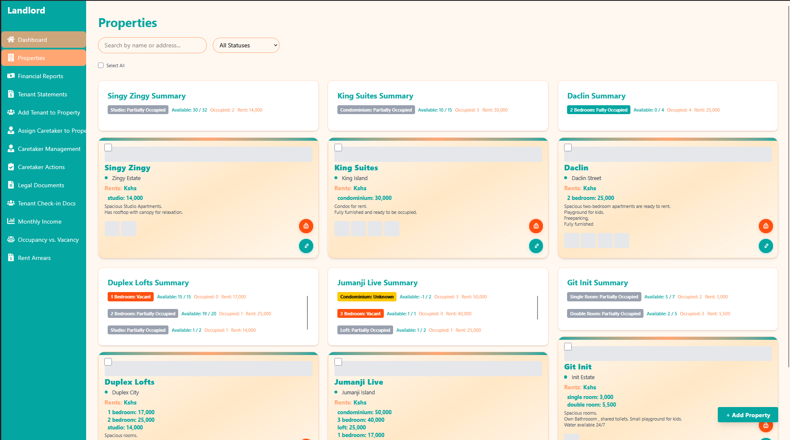

<p align="center">
  
</p>

# RentOwl – Rental Property Management System

RentOwl is a modern, full-stack rental property management platform for landlords, caretakers, and tenants. It streamlines property, finance, and communication workflows in one place.

---

## 🚧 Project Status

**This project is under active development.**

- The backend (Node.js/Express/MongoDB) is fully functional and tested with Postman.
- The frontend (React/JSX/Vite) has been fully migrated from TypeScript to JavaScript/JSX for easier maintenance and fewer build errors. All code is DRY, modular, and error-free.
- Registration now redirects users directly to the login page after successful signup (not the landing page).

---

## ✨ Features

### Landlord Capabilities

- View all properties in diagram format
- Access financial reports and rent summaries
- Generate tenant statements
- Assign caretaker duties to properties
- Monitor caretaker actions on tenant requests
- Access legal documents and agreements
- View tenant check-in documentation
- Access monthly income reports per property
- View occupancy vs. vacancy statistics
- Access rent arrears reports

### Caretaker Capabilities

- Report and manage property maintenance needs
- Assign and update maintenance tasks
- Mark issues as resolved
- Communicate with tenants through the app
- Send announcements and reports to tenants
- Update tenants on actions taken
- View rent payment status (paid/unpaid)
- View service history per property
- Track active maintenance requests

### Tenant Capabilities

- View housing agreement and rent payment history
- Make online payments (phone, bank card)
- View payment status updates
- Pay rent in full or partial amounts
- Download digital payment receipts
- Submit maintenance issues (with images, urgency)
- Track the status of submitted requests
- Receive announcements and payment reminders
- See late payment penalties if applicable

### System Features

- In-app messaging/chat functionality
- Push notifications for rent reminders, maintenance updates, and announcements
- Complaint escalation system (if caretaker doesn't respond within 48 hours)
- Lease management: track start/end dates, move-in/out checklists, automated reminders
- Records & reports for all roles
- Document repository for ID docs, utility bills, emergency contacts
- Payment processing: multiple methods, real-time status, reminders, digital receipts

---

## 🖼️ Screenshots

You can find screenshots in the `client/public/images/` folder:

- 
- 
- 
- 
- 
- 
- 
- 

---

## 🛠️ Tech Stack

### Frontend

- React 19
- Vite
- JavaScript (JSX, no TypeScript)
- Tailwind CSS
- Radix UI
- Chart.js

### Backend

- Node.js
- Express
- MongoDB
- Mongoose
- JWT authentication
- Passport
- Multer (file uploads)
- Socket.io (real-time features)

### Dev Tools

- ESLint
- Postman (API testing)
- pnpm

---

## 🚀 Getting Started

### Prerequisites

- Node.js, pnpm

### Install dependencies

```
pnpm install
cd client && pnpm install
cd ../server && pnpm install
```

### Run the app (dev)

```
cd server && pnpm run dev
cd ../client && pnpm run dev
```

### Build for production

```
cd client && pnpm run build
cd ../server && pnpm run build
```

---

## 📢 Notes

- The backend API is fully functional and tested with Postman.
- The frontend is under active development; some features and UI may change.
- For demo images, see the `client/public/images/` folder.

---

## 📬 Contact

For questions or contributions, contact [Brian Masheti](mailto:brianmasheti@outlook.com).
