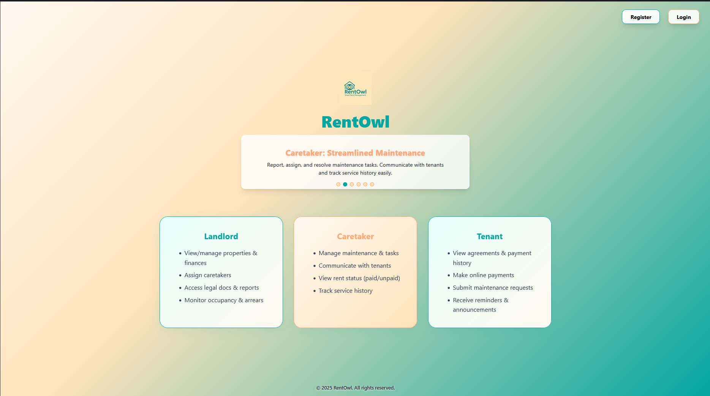

<p align="center">
  
</p>

# RentOwl – Rental Property Management System

RentOwl is a modern, full-stack rental property management platform for landlords, caretakers, and tenants. It streamlines property, finance, and communication workflows in one place.

---

## 🚧 Project Status

**This project is under active development.**

- The backend (Node.js/Express/MongoDB) is fully functional and tested with Postman.
- The frontend (React/JSX/Vite) has been fully migrated from TypeScript to JavaScript/JSX for easier maintenance and fewer build errors. All code is DRY, modular, and error-free.
- Registration now redirects users directly to the login page after successful signup (not the landing page).

---

## 🌟 Highlighted Features

### Caretaker Actions (Landlord Dashboard)
- Real-time caretaker activity log with instant updates via Socket.io
- Filter actions by caretaker, property, type, status, date, and description
- View full action details in a modal
- Export filtered actions as CSV
- See summary stats for quick insights
- Automated logging for maintenance resolutions and other key events
- Rate limiting for API protection
- Clean UI: section title shown only in nav, not repeated in content
- Only regular users (landlord, tenant, caretaker) can log in at `/login`
- Fully documented API (see Swagger docs at `/api/docs`)

### Super Admin & Admin Management (RBAC)
- Secure, dedicated super admin login at `/admin/login` (not public login)
- Super admin dashboard for managing all admins and support users
- Create, promote, demote, and assign permissions to admin/support users
- Role-based access control (RBAC) with roles: super_admin, admin, support, and permissions array
- Only super admins can access admin management endpoints and UI
- Admin/support users cannot log in at `/login` (permission denied)

#### Real-Time & Environment Setup
- The dashboard uses Socket.io for real-time updates.
- Configure your `.env` files:
  - `VITE_API_URL` for local backend (e.g., http://localhost:5000)
  - `VITE_API_URL_NETWORK` for LAN backend (e.g., http://192.168.x.x:5000)
- The frontend will automatically use the correct backend based on these variables.

### Advanced Assign Caretaker to Property Menu
- Assign caretakers to properties with a modern, interactive table
- View caretaker contact info, workload, and status directly in the menu
- Filter, sort, and search properties and caretakers
- Bulk assign a caretaker to multiple properties at once
- Quick view caretaker profile modal for more details
- Accessible and responsive UI for all devices

## ✨ Features

### Landlord Capabilities

- View all properties in diagram format
- Access financial reports and rent summaries
- Generate tenant statements
- Assign caretaker duties to properties with:
  - Caretaker contact info, workload, and status display
  - Filtering, sorting, and search for properties/caretakers
  - Bulk assignment to multiple properties
  - Caretaker profile quick view modal
  - Improved table presentation and accessibility
- Monitor caretaker actions on tenant requests
- Access legal documents and agreements
- View tenant check-in documentation
- Access monthly income reports per property
- View occupancy vs. vacancy statistics
- Access rent arrears reports

### Caretaker Capabilities

- Report and manage property maintenance needs
- Assign and update maintenance tasks
- Mark issues as resolved
- Communicate with tenants through the app
- Send announcements and reports to tenants
- Update tenants on actions taken
- View rent payment status (paid/unpaid)
- View service history per property
- Track active maintenance requests

### Tenant Capabilities

- View housing agreement and rent payment history
- Make online payments (phone, bank card)
- View payment status updates
- Pay rent in full or partial amounts
- Download digital payment receipts
- Submit maintenance issues (with images, urgency)
- Track the status of submitted requests
- Receive announcements and payment reminders
- See late payment penalties if applicable

### System Features

- In-app messaging/chat functionality
- Push notifications for rent reminders, maintenance updates, and announcements
- Complaint escalation system (if caretaker doesn't respond within 48 hours)
- Lease management: track start/end dates, move-in/out checklists, automated reminders
- Records & reports for all roles
- Document repository for ID docs, utility bills, emergency contacts
- Payment processing: multiple methods, real-time status, reminders, digital receipts

---

## 🖼️ Screenshots

You can find screenshots in the `client/public/images/` folder:

- 
- 
- 
- 
- 
- 
- 
- 

---

## 🛠️ Tech Stack

### Frontend

- React 19
- Vite
- JavaScript (JSX, no TypeScript)
- Tailwind CSS
- Radix UI
- Chart.js

### Backend

- Node.js
- Express
- MongoDB
- Mongoose
- JWT authentication
- Passport
- Multer (file uploads)
- Socket.io (real-time features)

### Dev Tools

- ESLint
- Postman (API testing)
- pnpm

---

## 🧪 Testing

### Backend API Tests
- Basic Jest/Supertest tests for caretaker actions API are located in `server/tests/caretakerAction.test.js`.
- To run backend tests:

```bash
cd server
pnpm test
```

### Frontend
- All frontend tests are located in `client/tests/`.
- Uses [Vitest](https://vitest.dev/) and [Testing Library](https://testing-library.com/) for React component testing.

### Run all tests

```bash
cd client
pnpm test
```

### Run tests with coverage

```bash
cd client
pnpm test:coverage
```

- Coverage reports are output to `client/coverage/` and are gitignored.

## 🚀 Getting Started

### Prerequisites

- Node.js, pnpm

### Install dependencies

```
pnpm install
cd client && pnpm install
cd ../server && pnpm install
```

### Run the app (dev)

```
cd server && pnpm run dev
cd ../client && pnpm run dev
```

### Build for production

```
cd client && pnpm run build
cd ../server && pnpm run build
```

---

## 📢 Notes

- The backend API now supports real-time caretaker action logging, filtering, and export.
- Rate limiting is enabled for all caretaker actions endpoints (60 requests per 15 minutes per IP).
- Automated logging is implemented for maintenance resolutions.
- API documentation is available at `/api/docs` (Swagger UI).
- The backend API is fully functional and tested with Postman.
- The frontend is under active development; some features and UI may change.
- For demo images, see the `client/public/images/` folder.

---

## 📬 Contact

For questions or contributions, contact [Brian Masheti](mailto:brianmasheti@outlook.com).
